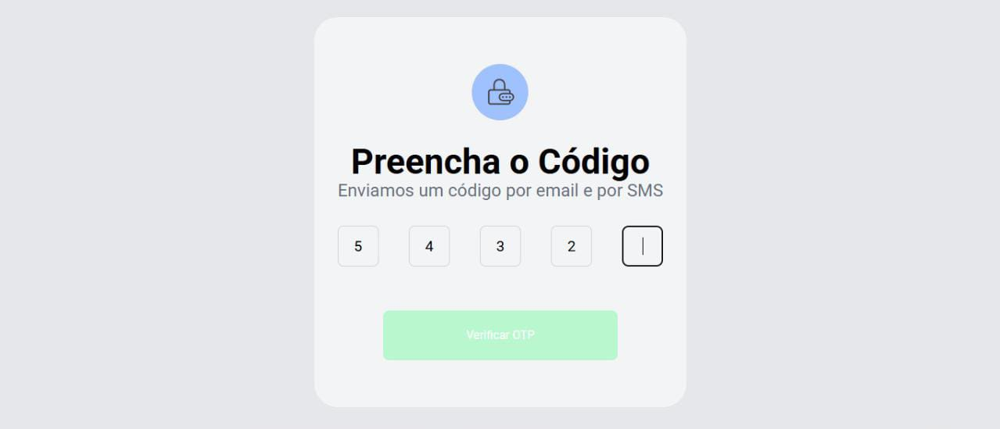

# 🔒 Verificador de Código de Segurança (OTP)



## 📝 Sobre o Projeto

Este é um componente front-end, desenvolvido em React, que simula uma tela de verificação de código de segurança (One-Time Password - OTP). O objetivo é fornecer uma interface de usuário robusta e intuitiva para a inserção de códigos de 5 dígitos, comumente enviados por e-mail ou SMS para autenticação de dois fatores (2FA).

O projeto foi construído com foco na experiência do usuário, implementando funcionalidades como o avanço automático entre os campos e a validação do estado do botão de envio.

---

## ✨ Funcionalidades Principais

-   **Inputs Individuais**: Interface com 5 campos, onde cada um aceita um único dígito.
-   **Foco Automático**: Ao digitar um número, o foco move-se automaticamente para o próximo campo, agilizando o preenchimento.
-   **Navegação com Teclado**: Suporte para `Backspace` (para apagar e voltar ao campo anterior) e para as setas direcionais (para navegar entre os campos).
-   **Botão com Estado Controlado**: O botão "Verificar OTP" permanece desabilitado até que todos os 5 dígitos sejam preenchidos, prevenindo envios incompletos.
-   **Validação Simples**: Ao submeter, o sistema verifica se o código está completo e exibe um alerta de sucesso.

---

## 🚀 Tecnologias Utilizadas

Este projeto foi desenvolvido utilizando tecnologias modernas do ecossistema front-end:

-   **[React](https://react.dev/)**: Biblioteca para a construção da interface e gerenciamento de estado.
-   **[TypeScript](https://www.typescriptlang.org/)**: Superset do JavaScript que adiciona tipagem estática ao código (se você usou, caso contrário, pode remover).
-   **[Tailwind CSS](https://tailwindcss.com/)**: Framework CSS utility-first para uma estilização rápida, moderna e customizável.
-   **[Vite](https://vitejs.dev/)**: Ferramenta de build de alta performance para um ambiente de desenvolvimento ágil.

---

## 🛠️ Como Executar o Projeto

Para rodar este projeto localmente, você precisará ter o Node.js e o npm (ou yarn) instalados.

1.  **Clone o repositório:**
    ```bash
    git clone [https://github.com/seu-usuario/seu-repositorio-otp.git](https://github.com/seu-usuario/seu-repositorio-otp.git)
    ```

2.  **Navegue até o diretório do projeto:**
    ```bash
    cd seu-repositorio-otp
    ```

3.  **Instale as dependências do projeto:**
    ```bash
    npm install
    ```
    *ou, se você usa yarn:*
    ```bash
    yarn install
    ```

4.  **Inicie o servidor de desenvolvimento:**
    ```bash
    npm run dev
    ```
    *ou, se você usa yarn:*
    ```bash
    yarn dev
    ```

5.  **Abra seu navegador** e acesse `http://localhost:5174` (ou a porta que aparecer no seu terminal).

---

## 🧠 Lógica Principal

O controle dos dígitos e do foco é gerenciado no React da seguinte forma:

-   Um estado `digits` (um array de strings) armazena o valor de cada um dos 5 campos.
-   Um array de `refs` (`useRef`) é criado para dar acesso direto a cada elemento `<input>` no DOM.
-   Funções de `callback` (`handleChange`, `handleBackspace`, etc.) manipulam tanto o estado `digits` quanto o foco dos inputs, movendo-o para frente ou para trás conforme a interação do usuário.
-   O estado `disabled` do botão é uma **variável derivada**, calculada em cada renderização, que simplesmente verifica se o código concatenado possui o tamanho esperado (5 caracteres).

---
